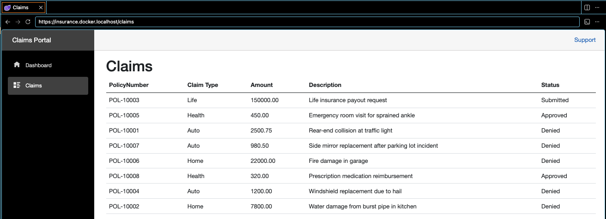
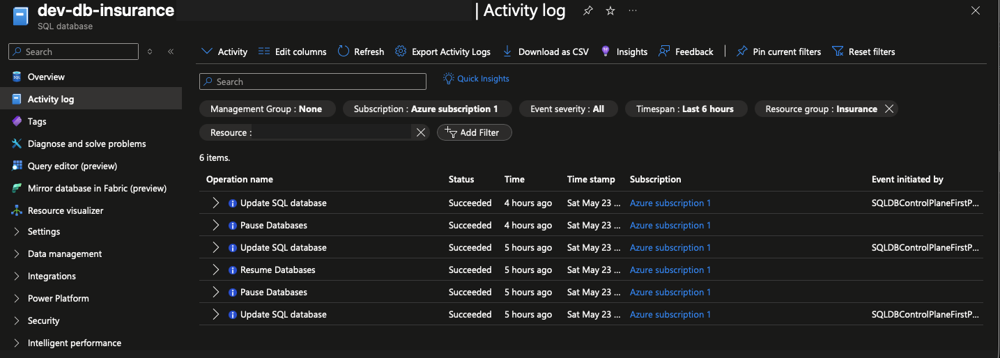
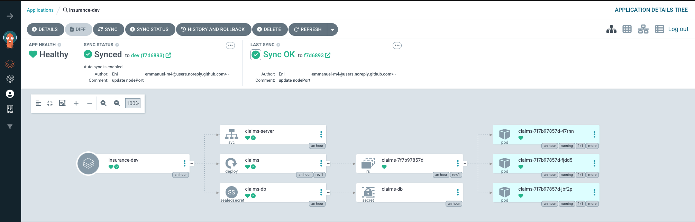
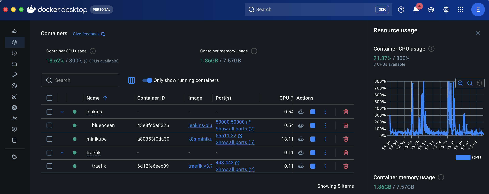
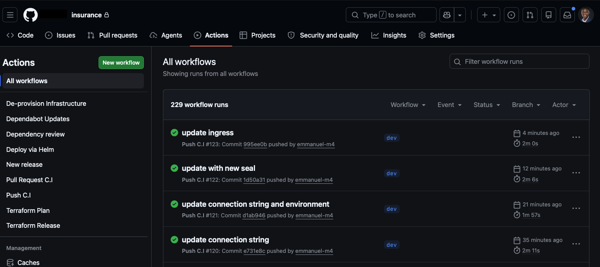
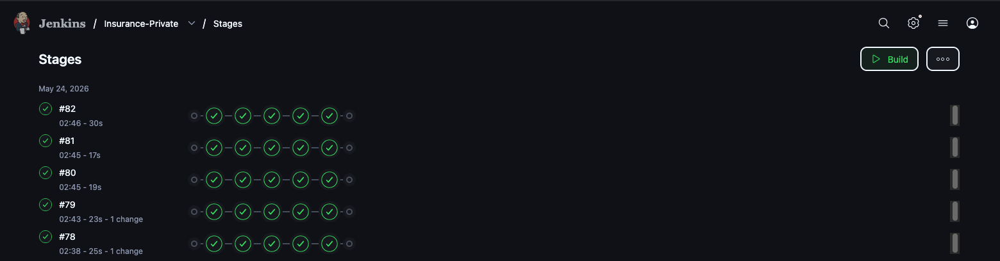
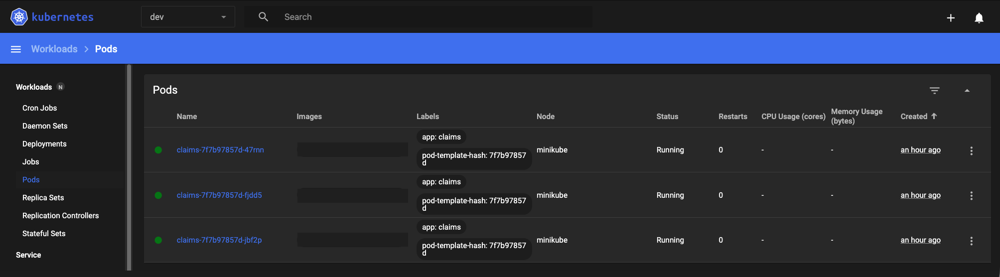
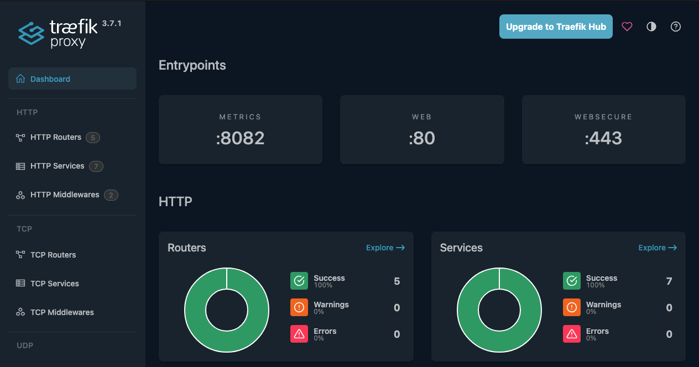

# Summary

This is a sandbox for exploring various software tools and principles. It currently hosts a Blazor Web Assembly project designed for claims management at an arbitrary insurance company.

>[!Note]
>Some tools serve the same function. Files are kept centralized to simplify context switching.

>[!Warning]
>Portions of this workspace have been omitted. See SECURITY.md for more details.

## App - Blazor WebAssembly

<div style="display: flex; overflow-x: auto; gap: 10px;">
  
</div>

## Workspace Structure

```text
.
├── github
│   ├── workflows
├── imgs
├── infra
│   ├── helm
│   │   └── templates
│   ├── k8s
│   ├── security
│   └── terraform
│       ├── dev
│       ├── prod
│       └── staging
├── ops
└── src
    ├── Client
    │   ├── Pages
    │   ├── Properties
    │   ├── Services
    │   ├── Shared
    │   └── wwwroot
    ├── Server
    │   ├── Controllers
    │   ├── Data
    │   ├── Mapping
    │   ├── Pages
    │   ├── Properties
    │   ├── cert
    ├── Shared
    │   ├── DTOs
    │   ├── Enums
    │   ├── Models
    ├── Test
    │   ├── TestResults
```

## [Azure](https://azure.microsoft.com/en-us)



## [ArgoCD](https://azure.microsoft.com/en-us)



## [Docker](https://www.docker.com/get-started/)



## [GitHub Actions](https://docs.github.com/en/actions)



## [Jenkins](https://www.jenkins.io/doc/)



## [Kubernetes](https://www.kubernetes.io)



## [Traefik](https://doc.traefik.io/traefik/)



